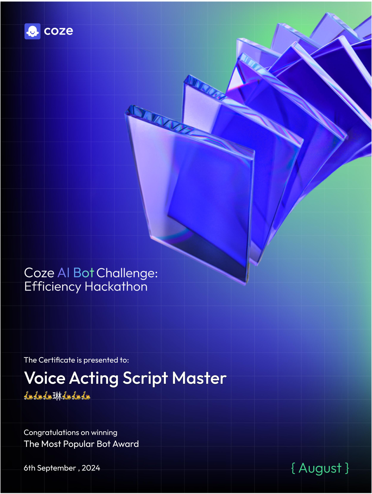

# 配音劇本大師 (Voice Acting Script Master)

✨ 您的虛擬配音劇本編輯助手！  
🎬 專業劇本創作與優化，讓您的聲音作品更上一層樓！  
🎙️ 適合配音、廣播劇、有聲書等多種聲音內容製作。

## Link

- [Coze Store](https://www.coze.com/s/Zs8DuptPQ/)

## 簡介

這是一個專門協助使用者製作配音劇本的 AI 助手。提供了從劇本編寫到格式建議的全方位支援，讓您能夠製作出專業水準的配音劇本。

## 特色功能

- 📝 **劇本創作**：協助撰寫或優化劇本內容
- 🎭 **舞台指示**：提供清晰的場景描述和動作指示 (ト書き)
- 🎧 **立體音效**：支援雙聲道錄音的方位標示
- 📋 **格式建議**：提供最佳的排版與呈現方式

## 使用方式

1. 選擇您想要使用的語言
2. 說明您的劇本需求或提供現有劇本
3. AI 將協助您完成或優化劇本

## 專業支援

- 💡 **劇本結構指導**
  - 場景描述
  - 動作指示
  - 音效標注
  - 對話安排

- 📐 **格式建議**
  - 字型大小建議 (11-14pt)
  - 適合字型推薦 (如明體)
  - 多角色對話排版
  - 直書/橫書格式建議

## 技術特點

- 支援 Markdown 格式輸出
- 整合 Catbox 檔案上傳功能
- 多語言支援

## 獲獎

Coze August AI Bot Challenge: Efficiency Hackathon

Most popular bots

